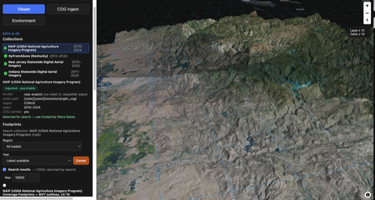
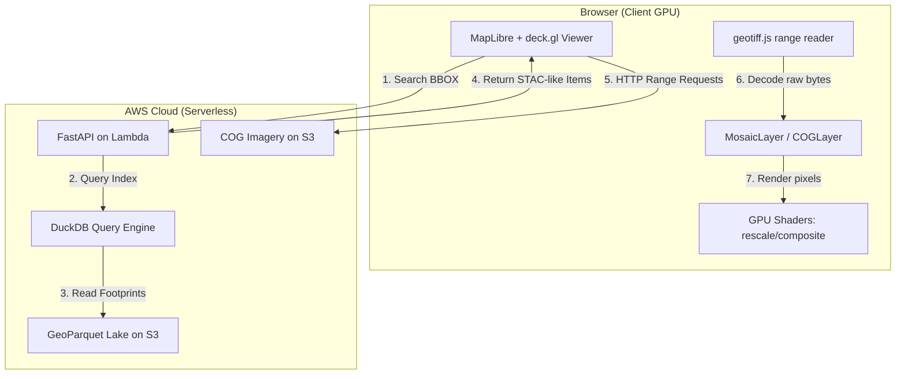

# deckgl-s3-cog-s1m

[](https://github.com/mwkorver/deckgl-s3-cog-s1m/actions/workflows/ci.yml)
[](LICENSE)
[](https://github.com/astral-sh/ruff)
[](https://biomejs.dev)

A working reference implementation of **client-side Cloud-Optimized GeoTIFF (COG) rendering** and **serverless spatial data lake indexing**.



*NAIP aerial imagery draped over the USGS 3DEP Seamless 1-meter DEM, rendered client-side in the browser directly from Cloud-Optimized GeoTIFFs.*

The core motivation for this project is to make the numerous open Cloud-Optimized GeoTIFF (COG) datasets hosted on Amazon S3 as part of the Registry of Open Data on AWS—including the USDA National Agriculture Imagery Program (NAIP) imagery and the USGS 3DEP Seamless 1-meter (S1M) elevation DEMs—more visible, accessible, and easily explorable for users directly in the browser.

## Intended audience and purpose

This application is intended for developers, cloud architects, geospatial engineers, and stakeholders involved with federal imagery and elevation programs such as NAIP and USGS 3DEP. It is not primarily a consumer map viewer; it is a working demonstration of how existing federal geospatial data already published on Amazon S3 can be accessed, indexed, searched, and visualized using a cloud-native architecture.

The project is meant to showcase practical patterns for public-sector geospatial modernization: Cloud-Optimized GeoTIFF range reads from S3, serverless metadata search over GeoParquet with DuckDB, requester-pays-aware asset signing, and browser-side GPU rendering of imagery and terrain. The goal is to make the architecture concrete enough for technical review, program evaluation, and reuse in operational prototypes around federal open data.

That purpose drives the viewer flow. The `Collection / Region / Year` controls let a user first inspect data availability and footprints in 2D at a CONUS scale, without paying the cost or cognitive load of terrain rendering. Once they understand which imagery exists for an area and vintage, they can move into the Viewer panel's 3D terrain mode and drape that imagery over the currently available USGS 3DEP S1M COG DEM coverage. In other words, the app separates broad federal-data discovery from detailed 3D inspection: first confirm the imagery footprint, then examine how that imagery behaves on the available 1-meter elevation surface.

> [!NOTE]
> **Gratitude & Attribution:** This application would have been impossible to build without the outstanding foundations of three key open-source projects:
> - **[DuckDB](https://duckdb.org/)**: The fast, in-process spatial SQL engine that powers the serverless GeoParquet data lake querying.
> - **[vis.gl / deck.gl](https://github.com/visgl/deck.gl)** and **[Development Seed's deck.gl-raster](https://github.com/developmentseed/deck.gl-raster)**: deck.gl provides the WebGL2/WebGPU visualization framework, while Development Seed's raster rendering work provides the foundation extended in this project for client-side band manipulation and color mapping.
> - **[Apache Parquet geospatial types](https://github.com/apache/parquet-format/blob/master/LogicalTypes.md#geometry)** and **[GeoParquet](https://geoparquet.org/)**: Parquet provides native `GEOMETRY` and `GEOGRAPHY` logical types, while GeoParquet supplies interoperability guidance and additional geospatial metadata. Together they make it possible to store and query spatial data without a separate GIS database server.
> 
> I am deeply indebted to their respective maintainers, specification groups, and communities for making high-performance, serverless geospatial maps viable.

By replacing an always-on spatial database with in-process DuckDB queries over GeoParquet on S3 and using deck.gl-raster's custom GPU shaders, this project performs multi-band compositing, linear rescaling, nodata filtering, color mapping, and raster rendering on the **client-side GPU**. COG range reads and TIFF decoding remain browser-side CPU and network work. A lightweight spatial search API queries the metadata index on S3 and returns STAC-like Item Collections without requiring a persistent GIS database such as PostGIS or Elasticsearch.

## Companion repositories

This repo is the viewer + serverless search half of a three-repo pipeline:

- **[sam-concept-worker](https://github.com/mwkorver/sam-concept-worker)** — the GPU inference stage: a spot-EC2 worker that runs SAM 3 text-concept segmentation over imagery chips, with an idle auto-stop watchdog. It can run as a cold per-call process or as a long-lived **warm HTTP worker** (`dev/serve_sam3.py`) that loads the model once and serves many chips. The `/detect` endpoint here (Feature 5) and the Similar tab's candidate verification both invoke it; the two repos are deliberately separate because their dependencies are mutually exclusive (rasterio/numpy 2 here, SAM 3/numpy 1 there) and they meet only at a queue and S3.
- **[embedding-harvester](https://github.com/mwkorver/embedding-harvester)** — the Stage-0 data producer: harvests published Clay foundation-model embeddings into a query-optimized GeoParquet lake on S3. The `/similar` endpoint reads that lake directly with the same in-process DuckDB pattern as `/search`.

---

## Architecture



1. **Client-Side Rendering:** The frontend viewer reads COG headers and pixel byte-ranges directly from S3 using HTTP Range Requests, decoding them in-browser via `geotiff.js`.
2. **GPU Processing:** Band compositing, linear rescaling, nodata masking, and display adjustments (brightness/contrast) are run in GLSL shaders directly on the client's GPU.
3. **Serverless Indexing:** An AWS Lambda function uses DuckDB to query a Hive-partitioned GeoParquet index directly on S3 and returns STAC-like Item Collections, eliminating the need for an always-on database server.

---

## Workflow: calibrate small, search wide, verify narrow

The viewer's tabs encode a cost ladder — each step de-risks the next before
spending more:

1. **Browse** (free). Find an area of interest. The Year dropdown shows each
   vintage's resolution, which determines what is physically detectable
   (a 1 m vintage cannot yield cars; 30 cm can).
2. **Detect on the current view** (one GPU chip, cents). This is concept
   calibration, not search: confirm SAM 3 actually sees "storage tank" at
   this resolution, at what score threshold, with what false-positive
   character — visually, on a small area, before trusting it at scale.
3. **Similar** (CPU only, no GPU). Once the concept is proven, pick the
   example on the map and the precomputed Clay embedding lake ranks every
   chip in the state by similarity — a brute-force DuckDB scan over
   GeoParquet on S3.
4. **Verify** (targeted GPU). SAM 3 runs only on the ranked top-K candidates,
   each against the newest imagery covering it. A verified detection can be
   clicked to become the next similarity query, closing the loop.

The GPU never looks at anything the embeddings did not first rank as worth
looking at. Measured on Rhode Island: an exhaustive statewide SAM 3 sweep is
~74,000 tiles (~4.5 GPU-hours); the cascade reached verified storage tanks on
the Port of Providence waterfront with one statewide embedding scan (223,413
chips, ~29 s, no GPU) plus five verification chips (~4 GPU-minutes). The
embedding lake is produced by the companion
[embedding-harvester](https://github.com/mwkorver/embedding-harvester); the
GPU stage is the companion
[sam-concept-worker](https://github.com/mwkorver/sam-concept-worker).

---

## Key Technical Features

### 1. Serverless Spatial Indexing (DuckDB + GeoParquet)
Instead of keeping a PostgreSQL/PostGIS database running 24/7, metadata searches are executed directly against a partitioned GeoParquet metadata tree on S3. When a `/search` request comes in:
- The backend mounts a read-only DuckDB instance in-process.
- DuckDB queries the Hive-partitioned GeoParquet index (`collection=*/region=*/year=*`).
- Hilbert clustering (`ST_Hilbert`) improves spatial locality within partitions, helping DuckDB use Parquet statistics to skip unrelated row groups.
- The ingest writer uses DuckDB's `GEOPARQUET_VERSION 'V2'`, producing WKB-backed columns annotated with Parquet's native `GEOMETRY` logical type plus GeoParquet 2.0 metadata for interoperability.

The application can also return on-demand [Segment Anything Model 3 (SAM 3)](https://github.com/facebookresearch/sam3) feature detections as GeoJSON — see **Feature 5** below. Detection results are not currently persisted in the GeoParquet lake.

### 2. Lazy, Per-COG URL Presigning (Requester-Pays Friendly)
To access requester-pays S3 assets securely:
- **Small Search Responses:** `POST /search` returns raw, un-signed `s3://` hrefs. This prevents response bloat (avoiding the addition of large STS credentials / tokens to every URL) and removes the latency of bulk presigning.
- **On-Demand Requests:** The frontend `MosaicLayer` uses `getSource()` to sign each COG URL via `GET /sign` only when that COG enters the active viewport. Its range requests then reuse the signed URL.
- **Caching & Coalescing:** Includes a client-side `signedUrlCache` with automatic TTL evictions, request coalescing for concurrent loads, and 403-handling to auto-renew expired signatures.
- **Token-Aware Self-Heal:** A presigned URL cannot outlive the STS token that signed it. When credentials come from short-lived, auto-rotating login sessions (~15 min), `GET /sign` bounds both the URL's `ExpiresIn` and the server-side presign cache to the token's *real* remaining life (parsing `expiresAt` timezone-aware so it is never over-trusted) and returns the true `expires_in`. The signing client rebuilds on the token's rotation cadence, so it never emits URLs signed with a dead token, and the viewer re-signs before expiry.
- **Priority Loading:** Uses Euclidean distance from the viewport center to sort and load tiles center-out.

### 3. GPU-Accelerated Raster Shaders
The custom render pipeline uses `luma.gl` shader modules for client-side processing:
- **Shader Pipelines:** Chained operations process raw pixels: decoding (`FilterNoDataVal`, `CompositeBands`), numeric transformation (`LinearRescale`), and color mapping (`Colormap`, `BlackIsZero`, `CMYKToRGB`).
- **16-Bit Normalization:** Unsigned 16-bit integer bands (like New Jersey imagery) are normalized and stretched dynamically.
- **Firefox/Browser Compatibility:** Implements a CPU-based fallback mechanism that detects lack of native 16-bit texture support (`EXT_texture_norm16` missing in Firefox), rescaling data to 8-bit before GPU upload as `rgba8unorm` textures.

### 4. Compact EPSG database (309KB)
Web applications requiring projections usually load massive database bundles. `@s3-cog/epsg` compresses all 7,352 EPSG projection WKT2 definitions into a tiny **309KB** package using the browser's native `DecompressionStream` API to unpack gzip data on-the-fly.

### 5. Text-Prompted Object Detection (SAM 3)
A `POST /detect` endpoint runs [Segment Anything Model 3](https://github.com/facebookresearch/sam3) against any visible imagery on demand:
- DuckDB selects a COG covering the current map center (via the same self-healing lake query as `/search`), and rasterio range-reads a 1008×1008 pixel chip at native resolution — the model's input size, so COG pixel = chip pixel = model pixel for maximum small-object fidelity.
- **Multi-prompt union:** comma-separated concepts (e.g. `building, rooftop, house`) share one image encode and decode per prompt; synonyms fire on different instances, lifting recall.
- Each instance's SAM mask is vectorized into a generalized polygon (building concepts are orthogonalized to their dominant angle), reprojected from the COG's native CRS to EPSG:4326, and returned as a GeoJSON FeatureCollection drawn as filled polygons.
- **World-space dedup:** all candidates are pooled and run through greedy NMS (drop IoU > 0.5 against a higher-scoring keep), collapsing both cross-synonym hits and the same object seen in adjacent tiles.
- **Tiling for large areas:** beyond a single chip, a larger ground footprint (`chip_m`) is covered by a grid of *native* 1008-px tiles instead of one decimated read — full small-object detail everywhere — meshed into one batched inference and stitched via the world-space dedup above. A per-request cap bounds the fan-out.
- A simple object-size/GSD heuristic in the UI warns when the imagery may be too coarse for the requested concept; it is guidance, not a validated detection limit.

The endpoint is a synchronous adapter for local manual testing. It reaches the
companion [`sam-concept-worker`](https://github.com/mwkorver/sam-concept-worker)
either as a **warm HTTP worker** (`SAM3_WORKER_URL`, model loaded once — strongly
preferred for interactive use and required for tiling's batched inference) or, as
a fallback, a **cold per-call subprocess** (`SAM3_PYTHON`/`SAM3_SCRIPT`). Because
the API's rasterio environment and SAM 3 require incompatible NumPy versions, run
the API on the host when using `/detect`; the standard Docker Compose service does
not include the SAM runtime. Measured L4 tests found ~0.16 s to encode a chip and
~0.06 s per prompt decode once the model was warm. Detection results are returned
directly and are not persisted.

### 6. Declarative & Semi-Automated Onboarding
Adding new image collections is simplified via layout inference:
- A CLI validates candidate files using a light, dependency-free TIFF header probe.
- Year tokens are extracted automatically using regex patterns.
- Geographies/regions are classified spatially using the header's coordinate transform against standard boundaries.
- Produces clean declarative config in [registry.yaml](app/collections/registry.yaml) without writing custom Python parsing code.

### 7. Elevation as 3D Terrain (USGS 3DEP S1M DEMs)
The USGS 3DEP **Seamless 1-meter (S1M)** DEM is a CONUS-wide elevation dataset distributed as COG + metadata pairs in the public USGS bucket (`s3://prd-tnm/StagedProducts/Elevation/S1M/`, NAD83(2011) Conus Albers / NAVD88). The viewer renders it as a **3D mesh, not as flat imagery**:
- **Tile discovery:** the whole-collection footprint index contains ~9,600 tile polygons, each carrying its COG path. It is converted from the source GeoPackage to Parquet ahead of time; the reader uses bbox columns for DuckDB pruning and WKB for the exact point-in-polygon check.
- **`POST /s1m/tiles`** takes a viewport `bbox` (and optional `center`) and returns the covering S1M tiles — each with its public COG URL and footprint ring — ordered nearest-first. This is the only S1M server endpoint; it does not read or download any DEM pixels.
- **Client-side DEM read + meshing:** the viewer reads each covering S1M COG **directly from the public `prd-tnm` bucket in the browser** (range reads over the COG overviews, decoded by the same float-COG reader the imagery pipeline uses), masks the `-999999` nodata, and decodes the grid into a `SimpleMeshLayer` in `METER_OFFSETS` space — ENU meters from the tile center, height = elevation × exaggeration, with per-vertex normals for hillshade-style shading and a hypsometric color ramp. Resolution and vertical exaggeration are adjustable; nodata voids are dropped. No server-side DEM read, no token, and no separate Function URL are involved.
- **Index build/publish:** the USGS GeoPackage is converted to `lake/s1m/S1M_Products.parquet` in the viewer bucket with [`app/api/build_s1m_index.py`](app/api/build_s1m_index.py) and published with [`app/lambda/publish-s1m-index.sh`](app/lambda/publish-s1m-index.sh). The read API's `/s1m/tiles` queries that Parquet directly with DuckDB (bbox statistics + an exact geometry check); it does not parse the GeoPackage at runtime.

S1M coverage is CONUS-only and still expanding; viewport areas with no S1M tile simply render no terrain mesh there.

> **Consolidated into the main read API (2026-06):** S1M was previously a standalone terrain Lambda fronted by a token-guarded Function URL (`/s1m/terrain`, `S1M_DEMO_TOKEN`, `deploy-s1m.sh`). That service was removed; terrain discovery (`/s1m/tiles`) is now part of the `deckgl-s3-cog-s1m-read` API, and the DEM read moved entirely into the browser.

---

## Repository Structure

The project is managed as a monorepo containing Shared TypeScript Packages (`pnpm` workspaces) and an Application suite:

### Shared Packages (`packages/`)
*   **[deck.gl-geotiff](packages/deck.gl-geotiff)**: High-level `COGLayer` integrating with `deck.gl`'s `TileLayer`.
*   **[deck.gl-raster](packages/deck.gl-raster)**: Custom shaders and GPU modules (`luma.gl` `ShaderModule` instances) for dynamic color operations and filters.
*   **[geotiff](packages/geotiff)**: Range-read and optimization wrappers for in-browser COG retrieval.
*   **[morecantile](packages/morecantile)**: TypeScript port of the OGC Tile Matrix Set (TMS) specification.
*   **[proj](packages/proj)**: Coordinate projection systems, coordinate system conversions, and bounding-box calculations.
*   **[affine](packages/affine)**: Matrix coordinate transformations.
*   **[epsg](packages/epsg)**: Lightweight compressed database supplying OGC WKT2 strings for all 7,352 EPSG codes.
*   **[raster-reproject](packages/raster-reproject)**: Standalone client-side mesh generation and refinement for raster reprojections.

### Applications (`app/`)
*   **[api](app/api)**: Python FastAPI Server that serves `/search`, `/availability`, and `/sign` (using an in-process DuckDB database connection), plus the on-demand `/detect` (SAM 3) and `/s1m/tiles` (3DEP elevation tile discovery) endpoints.
*   **[viewer](app/viewer)**: Static single-page application built on MapLibre and deck.gl, querying the local/deployed API and rendering tiles dynamically.
*   **[lambda](app/lambda)**: AWS SAM templates and automation scripts (deploying the read/ingest Lambdas, the DuckDB layer, and the S3-hosted static viewer).

---

## Getting Started

### Prerequisites
*   **Node.js** (v20+) & **pnpm** (v10+) — CI runs on Node 20
*   **Python** (v3.12+)
*   **Docker** (for SAM container packaging and local testing)
*   **AWS CLI** & **AWS SAM CLI** (for cloud deployments)

### 1. Installation & Build
This repo uses git submodules for the TypeScript test fixtures
(`fixtures/geotiff-test-data`) and the OGC Tile Matrix Set spec
(`packages/morecantile/spec`). Clone with submodules — or initialize them in
an existing clone — otherwise `pnpm test` and the `morecantile` package fail:
```bash
git clone --recurse-submodules https://github.com/mwkorver/deckgl-s3-cog-s1m.git
# or, in an existing clone:
git submodule update --init --recursive
```

Install workspace dependencies and compile the TS packages:
```bash
pnpm install
pnpm build
```

### 2. Local Development
Configure the environment variables:
```bash
cd app
cp .env.example .env
# Set AWS_PROFILE=deckgl-s3-cog-s1m-deploy and any local parameters
```

To spin up the local stack (FastAPI server + static viewer) via Docker Compose:
```bash
docker compose up --build
```
Once started, the viewer will be accessible at: **`http://localhost:8089/viewer/`**

For detailed local onboarding and ingest pipelines, see [app/README.md](app/README.md).

### 3. Testing
CI (`.github/workflows/ci.yml`) runs the checks below on every push and pull
request: Biome + Ruff lint/format, `typecheck`, the TypeScript package tests,
and the Python API tests.

TypeScript packages (Vitest). Requires the git submodules from step 1 for the
`geotiff` and `morecantile` fixtures:
```bash
pnpm typecheck
pnpm test
```

Lint and format (Biome for TS, Ruff for Python). `requirements-dev.txt`
provides Ruff plus the pytest/httpx used by the API tests:
```bash
python3 -m pip install -r requirements-dev.txt
pnpm check       # biome + ruff, read-only
pnpm check:fix   # apply fixes
```

Python API and ingest tests (pytest). `/health` creates a DuckDB S3 secret
via the AWS credential chain, so provide credentials — real or dummy:
```bash
pip install -r app/api/requirements.txt
cd app/api
AWS_ACCESS_KEY_ID=testing \
AWS_SECRET_ACCESS_KEY=testing \
AWS_DEFAULT_REGION=us-west-2 \
python3 -m pytest
```

### 4. Deployment
The AWS deployment is intentionally region-locked to **`us-west-2`** because its primary source COG buckets (`naip-analytic`, `njogis-imagery`, and `kyfromabove`) reside there. Deploying compute and indexing in the same region minimizes cross-region latency and eliminates data-transfer charges.

For the step-by-step guide to deploying the serverless ingest, query (read), and static viewer stacks, please refer to the deployment section in **[app/README.md](app/README.md#deploying-to-aws)**.

---

## License
This project is licensed under the [MIT License](LICENSE).
