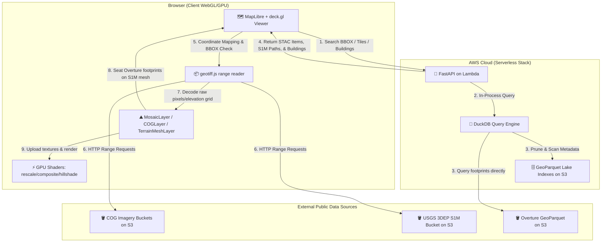

# deckgl-s3-cog-s1m

[](https://github.com/mwkorver/deckgl-s3-cog-s1m/actions/workflows/ci.yml)
[](LICENSE)
[](https://github.com/astral-sh/ruff)
[](https://biomejs.dev)

> [!NOTE]
> **Reference implementation, released under [MIT](LICENSE) — use, fork, and adapt it freely.** It is a prototype provided as-is, with no support or active maintenance; issues and pull requests aren't monitored, so please fork rather than wait on changes here. The TypeScript packages under [`packages/`](packages/) are derived from [Development Seed's deck.gl-raster](https://github.com/developmentseed/deck.gl-raster) (MIT) — see the per-package `LICENSE` files.

A working reference implementation of **client-side Cloud-Optimized GeoTIFF (COG) rendering** and **serverless spatial data lake indexing**.


*NAIP aerial imagery draped over the USGS 3DEP Seamless 1-meter DEM, rendered client-side in the browser directly from Cloud-Optimized GeoTIFFs.*

## Why this repository exists

I was browsing the excellent **deck.gl-raster** examples:

https://developmentseed.org/deck.gl-raster/examples/

One of the demos renders a NAIP mosaic using the Microsoft Planetary Computer. Which made me wonder: **why is it always Microsoft's copy of NAIP?**

The original cloud-hosted NAIP archive landed on Amazon S3 years ago as part of the AWS Open Data Program. It was the first large geospatial dataset to prove you could stop shipping hard drives around and start treating imagery like any other cloud-native data source. I know because I was the person at AWS who received the 24? SATA drives. I spent a good chunk of my time at AWS helping customers do this kind of thing, so seeing the S3 version mostly absent from recent demos felt... a bit sad.

So this repository started as a simple exercise: take the demo and point it at **`s3://naip-analytic`** instead.

Then scope creep happened.

Around the same time, I learned that the USGS released the **Seamless 1 Meter Digital Elevation Model (S1M)** as part of the 3D Elevation Program (3DEP).

https://www.usgs.gov/3d-elevation-program/new-product-3d-elevation-program-seamless-1-meter-digital-elevation-model-s1m

The word *seamless* caught my eye. Years ago, while building a browser-based 3D visualization system with a small team in Tokyo, stitching DEMs together without ugly seams consumed far more engineering effort than it should have. Seeing someone solve that problem at continental scale naturally raises the question:

*What can you build with it?*

The answer, at least for this repository, is a browser that streams imagery and terrain directly from object storage. No tile server. No terrain server. No rendering backend. Just Cloud Optimized GeoTIFFs, HTTP range requests, WebGL, and a little JavaScript.

Well... almost.

There are a couple of AWS Lambda functions. One answers the question, "Which COGs cover the current view?" Another ingests newly published COGs into the catalog. Everything interesting happens in the browser.

Since we already have terrain, it seemed a shame not to add buildings. Flip on the **Show Buildings** checkbox and the application pulls footprints from the Overture Maps Foundation dataset, samples each footprint against the S1M terrain so it sits on the ground instead of floating in space, and extrudes it into a 3D model.

The broader goal is to explore what modern cloud-native geospatial applications look like when the cloud stores the data, the browser does the work, and servers mostly get out of the way.

## Intended audience and purpose

This application is intended for developers, cloud architects, geospatial engineers, and stakeholders involved with federal imagery and elevation programs such as NAIP and USGS 3DEP. It is not a consumer map viewer; it's a working demonstration of how existing federal geospatial data already published on Amazon S3 can be accessed, indexed, searched, and visualized using a cloud-native architecture.

The project is meant to showcase practical patterns for public-sector geospatial modernization: Cloud-Optimized GeoTIFF range reads from S3, serverless metadata search over GeoParquet with DuckDB, requester-pays-aware asset signing, and browser-side GPU rendering of imagery and terrain. The goal is to make the architecture concrete enough for technical review, program evaluation, and reuse in operational prototypes around federal open data.

That purpose drives the viewer flow. The `Collection / Region / Year` controls let a user first inspect data availability and footprints in 2D at a CONUS scale, without paying the cost or cognitive load of terrain rendering. Once they understand which imagery exists for an area and vintage, they can move into the Viewer panel's 3D terrain mode and drape that imagery over the currently available USGS 3DEP S1M COG DEM coverage. In other words, the app separates broad federal-data discovery from detailed 3D inspection: first confirm the imagery footprint, then examine how that imagery behaves on the available 1-meter elevation surface.

> [!NOTE]
> **Gratitude & Attribution:** This application would have been impossible to build without the outstanding foundations of several open-source projects:
> - **[Cloud-Optimized GeoTIFF (COG)](https://www.cogeotiff.org/)** and **[GDAL](https://gdal.org/)**: This project is built on the COG standard for streaming raster data over HTTP. Special thanks to Even Rouault, the lead maintainer of GDAL, libtiff, and PROJ, whose tireless work on these foundational libraries powers the entire cloud-native geospatial ecosystem.
> - **[vis.gl / deck.gl](https://github.com/visgl/deck.gl)** and **[Development Seed's deck.gl-raster](https://github.com/developmentseed/deck.gl-raster)**: deck.gl provides the WebGL2/WebGPU visualization framework. The TypeScript packages under [`packages/`](packages/) are **derived from Development Seed's deck.gl-raster monorepo** (MIT) and extended here for client-side band manipulation, color mapping, and COG/terrain rendering — each retains the upstream copyright in its `LICENSE`.
> - **[DuckDB](https://duckdb.org/)**: The fast, in-process spatial SQL engine that powers the serverless GeoParquet data lake querying.
> - **[Apache Parquet geospatial types](https://github.com/apache/parquet-format/blob/master/LogicalTypes.md#geometry)** and **[GeoParquet](https://geoparquet.org/)**: Parquet provides native `GEOMETRY` and `GEOGRAPHY` logical types, while GeoParquet supplies interoperability guidance and additional geospatial metadata. Together they make it possible to store and query spatial data without a separate GIS database server.
> 
> I am deeply indebted to their respective maintainers, specification groups, and communities for making high-performance, serverless geospatial maps viable.

By replacing an always-on spatial database with in-process DuckDB queries over GeoParquet on S3 and using deck.gl-raster's custom GPU shaders, this project performs multi-band compositing, linear rescaling, nodata filtering, color mapping, and raster rendering on the **client-side GPU**. COG range reads and TIFF decoding remain browser-side CPU and network work. A lightweight spatial search API queries the metadata index on S3 and returns STAC-like Item Collections without requiring a persistent GIS database such as PostGIS or Elasticsearch. Additionally, to support requester-pays buckets (like `naip-analytic`) securely and cost-effectively, the architecture decouples footprint search from pixel fetching, allowing the browser to sign and read S3 ranges lazily only when individual tiles enter the visible viewport.

## Architecture



1. **Client-Side Rendering & Terrain Drape:** The frontend viewer reads COG imagery and USGS S1M elevation data directly from public S3 buckets using HTTP Range Requests, decoding them in-browser via `geotiff.js` to build 3D terrain meshes.
2. **GPU Processing:** Band compositing, linear rescaling, nodata masking, and terrain hillshading are run in GLSL shaders directly on the client's GPU.
3. **Serverless Indexing:** An AWS Lambda function uses DuckDB to query Hive-partitioned GeoParquet indexes (imagery metadata, USGS S1M tile layouts, and Overture building footprints) directly on S3 and returns results without requiring a persistent database server.

---

## Key Technical Features

### 1. Serverless Spatial Indexing (DuckDB + GeoParquet)
Instead of keeping a PostgreSQL/PostGIS database running 24/7, metadata searches are executed directly against a partitioned GeoParquet metadata tree on S3. When a `/search` request comes in:
- The backend mounts a read-only DuckDB instance in-process.
- DuckDB queries the Hive-partitioned GeoParquet index (`collection=*/region=*/year=*`).
- Hilbert clustering (`ST_Hilbert`) improves spatial locality within partitions, helping DuckDB use Parquet statistics to skip unrelated row groups.
- The ingest writer uses DuckDB's `GEOPARQUET_VERSION 'V2'`, producing WKB-backed columns annotated with Parquet's native `GEOMETRY` logical type plus GeoParquet 2.0 metadata for interoperability.

### 2. Lazy, Per-COG URL Presigning (Requester-Pays Friendly)
To access requester-pays S3 assets securely:
- **Small Search Responses:** `POST /search` returns raw, un-signed `s3://` hrefs. This prevents response bloat (avoiding the addition of large STS credentials / tokens to every URL) and removes the latency of bulk presigning.
- **On-Demand Requests:** The frontend `MosaicLayer` uses `getSource()` to sign each COG URL via `GET /sign` only when that COG enters the active viewport. Its range requests then reuse the signed URL.
- **Caching & Coalescing:** Includes a client-side `signedUrlCache` with automatic TTL evictions, request coalescing for concurrent loads, and 403-handling to auto-renew expired signatures.
- **Token-Aware Self-Heal:** A presigned URL cannot outlive the STS token that signed it. When credentials come from short-lived, auto-rotating login sessions (~15 min), `GET /sign` bounds both the URL's `ExpiresIn` and the server-side presign cache to the token's *real* remaining life (parsing `expiresAt` timezone-aware so it is never over-trusted) and returns the true `expires_in`. The signing client rebuilds on the token's rotation cadence, so it never emits URLs signed with a dead token, and the viewer re-signs before expiry.
- **Priority Loading:** Uses Euclidean distance from the viewport center to sort and load tiles center-out.

### 3. Declarative & Semi-Automated Onboarding
Adding new image collections is simplified via layout inference:
- A CLI validates candidate files using a light, dependency-free TIFF header probe.
- Year tokens are extracted automatically using regex patterns.
- Geographies/regions are classified spatially using the header's coordinate transform against standard boundaries.
- Produces clean declarative config in [registry.yaml](app/collections/registry.yaml) without writing custom Python parsing code.

### 4. Elevation as 3D Terrain (USGS 3DEP S1M DEMs)
The USGS 3DEP **Seamless 1-meter (S1M)** DEM is a CONUS-wide elevation dataset distributed as COG + metadata pairs in the public USGS bucket (`s3://prd-tnm/StagedProducts/Elevation/S1M/`, NAD83(2011) Conus Albers / NAVD88). The viewer renders it as a **3D mesh, not as flat imagery**:
- **Tile discovery:** the whole-collection footprint index contains ~9,600 tile polygons, each carrying its COG path. It is converted from the source GeoPackage to Parquet ahead of time; the reader uses bbox columns for DuckDB pruning and WKB for the exact point-in-polygon check.
- **`POST /s1m/tiles`** takes a viewport `bbox` (and optional `center`) and returns the covering S1M tiles — each with its public COG URL and footprint ring — ordered nearest-first. This is the only S1M server endpoint; it does not read or download any DEM pixels.
- **Client-side DEM read + meshing:** the viewer reads each covering S1M COG **directly from the public `prd-tnm` bucket in the browser** (range reads over the COG overviews, decoded by the same float-COG reader the imagery pipeline uses), masks the `-999999` nodata, and decodes the grid into a `SimpleMeshLayer` in `METER_OFFSETS` space — ENU meters from the tile center, height = elevation × exaggeration, with per-vertex normals for hillshade-style shading and a hypsometric color ramp. Resolution and vertical exaggeration are adjustable; nodata voids are dropped. No server-side DEM read, no token, and no separate Function URL are involved.
- **Index build/publish:** the USGS GeoPackage is converted to `lake/s1m/S1M_Products.parquet` in the viewer bucket with [`app/api/build_s1m_index.py`](app/api/build_s1m_index.py) and published with [`app/lambda/publish-s1m-index.sh`](app/lambda/publish-s1m-index.sh). The read API's `/s1m/tiles` queries that Parquet directly with DuckDB (bbox statistics + an exact geometry check); it does not parse the GeoPackage at runtime.

S1M coverage is CONUS-only and still expanding; viewport areas with no S1M tile simply render no terrain mesh there.

> **Consolidated into the main read API (2026-06):** S1M was previously a standalone terrain Lambda fronted by a token-guarded Function URL (`/s1m/terrain`, `S1M_DEMO_TOKEN`, `deploy-s1m.sh`). That service was removed; terrain discovery (`/s1m/tiles`) is now part of the `deckgl-s3-cog-s1m-read` API, and the DEM read moved entirely into the browser.

### 5. Buildings from Overture (terrain-seated 3D extrusions)
The **Show buildings** toggle overlays building footprints from the [Overture Maps Foundation](https://overturemaps.org/) dataset:
- **`POST /buildings/overture`** bbox-prunes a CONUS row-group index ([`build_overture_buildings_index.py`](app/api/build_overture_buildings_index.py)) to the viewport, then reads only the matching row groups straight from Overture's public GeoParquet release — the same in-process DuckDB pattern as `/search` — with a local GeoParquet fallback.
- Each footprint is sampled against the loaded S1M terrain mesh so it sits on the ground instead of floating, then extruded to its height and rendered as a MapLibre `fill-extrusion` layer.

---

## Repository Structure

The project is managed as a monorepo containing Shared TypeScript Packages (`pnpm` workspaces) and an Application suite:

### Shared Packages (`packages/`)
Derived from [Development Seed's deck.gl-raster](https://github.com/developmentseed/deck.gl-raster) monorepo (MIT — see each package's `LICENSE`), vendored here so the viewer builds standalone. Listed for orientation; they are not this project's contribution.
*   **[deck.gl-geotiff](packages/deck.gl-geotiff)**: High-level `COGLayer` integrating with `deck.gl`'s `TileLayer`.
*   **[deck.gl-raster](packages/deck.gl-raster)**: Custom shaders and GPU modules (`luma.gl` `ShaderModule` instances) for dynamic color operations and filters.
*   **[geotiff](packages/geotiff)**: Range-read and optimization wrappers for in-browser COG retrieval.
*   **[morecantile](packages/morecantile)**: TypeScript port of the OGC Tile Matrix Set (TMS) specification.
*   **[proj](packages/proj)**: Coordinate projection systems, coordinate system conversions, and bounding-box calculations.
*   **[affine](packages/affine)**: Matrix coordinate transformations.
*   **[epsg](packages/epsg)**: Lightweight compressed database supplying OGC WKT2 strings for all 7,352 EPSG codes.
*   **[raster-reproject](packages/raster-reproject)**: Standalone client-side mesh generation and refinement for raster reprojections.

### Applications (`app/`)
*   **[api](app/api)**: Python FastAPI Server that serves `/collections`, `/search`, `/availability`, and `/sign` (using an in-process DuckDB database connection), plus `/s1m/tiles` (3DEP elevation tile discovery) and `/buildings/overture` (Overture footprints) endpoints.
*   **[viewer](app/viewer)**: Static single-page application built on MapLibre and deck.gl, querying the local/deployed API and rendering tiles dynamically.
*   **[lambda](app/lambda)**: AWS SAM templates and automation scripts (deploying the read/ingest Lambdas, the DuckDB layer, and the S3-hosted static viewer).

---

## Getting Started

### Prerequisites
*   **Node.js** (v20+) & **pnpm** (v10+) — CI runs on Node 20
*   **Python** (v3.12+)
*   **Docker** (for AWS SAM container builds and local testing)
*   **AWS CLI** & **AWS SAM CLI** (for cloud deployments)

### 1. Installation & Build
This repo uses git submodules for the TypeScript test fixtures
(`fixtures/geotiff-test-data`) and the OGC Tile Matrix Set spec
(`packages/morecantile/spec`). Clone with submodules — or initialize them in
an existing clone — otherwise `pnpm test` and the `morecantile` package fail:
```bash
git clone --recurse-submodules https://github.com/mwkorver/deckgl-s3-cog-s1m.git
# or, in an existing clone:
git submodule update --init --recursive
```

Install workspace dependencies and compile the TS packages:
```bash
pnpm install
pnpm build
```

### 2. Local Development
Configure the environment variables:
```bash
cd app
cp .env.example .env
# Set AWS_PROFILE=deckgl-s3-cog-s1m-deploy and any local parameters
```

To spin up the local stack (FastAPI server + static viewer) via Docker Compose:
```bash
docker compose up --build
```
Once started, the viewer will be accessible at: **`http://localhost:8089/viewer/`**

For detailed local onboarding and ingest pipelines, see [app/README.md](app/README.md).

### 3. Testing
CI (`.github/workflows/ci.yml`) runs the checks below on every push and pull
request: Biome + Ruff lint/format, `typecheck`, the TypeScript package tests,
and the Python API tests.

TypeScript packages (Vitest). Requires the git submodules from step 1 for the
`geotiff` and `morecantile` fixtures:
```bash
pnpm typecheck
pnpm test
```

Lint and format (Biome for TS, Ruff for Python). `requirements-dev.txt`
provides Ruff plus the pytest/httpx used by the API tests:
```bash
python3 -m pip install -r requirements-dev.txt
pnpm check       # biome + ruff, read-only
pnpm check:fix   # apply fixes
```

Python API and ingest tests (pytest). `/health` creates a DuckDB S3 secret
via the AWS credential chain, so provide credentials — real or dummy:
```bash
pip install -r app/api/requirements.txt
cd app/api
AWS_ACCESS_KEY_ID=testing \
AWS_SECRET_ACCESS_KEY=testing \
AWS_DEFAULT_REGION=us-west-2 \
python3 -m pytest
```

### 4. Deployment
The AWS deployment runs in **`us-west-2`**, where the GeoParquet lake and most source COG buckets — including the primary NAIP archive (`naip-analytic`), Kentucky (`kyfromabove`), and New Jersey (`njogis-imagery`) — reside, keeping compute, indexing, and the bulk of imagery reads in-region. Indiana (`gisimageryingov`) sources cross-region — it is in `us-east-2` — and pays data transfer for its tiles.

A fresh deployment comes up with a working lake, not an empty one. The foundation stack creates the deployer's retained viewer/output bucket and **seeds its `lake/` prefix from a shared, read-only seed bucket (`deckgl-s3-cog-s1m-seed-us-west2`)** — a CloudFormation custom resource copies the demo GeoParquet footprints and the S1M and Overture-buildings indexes on create/update. The seed is a demo subset — only some NAIP states and years have been ingested — so the ingest path is there to add or refresh collections beyond it.

For the step-by-step guide to deploying the serverless ingest, query (read), and static viewer stacks, please refer to the deployment section in **[app/README.md](app/README.md#deploying-to-aws)**.

---

## License
This project is licensed under the [MIT License](LICENSE).
