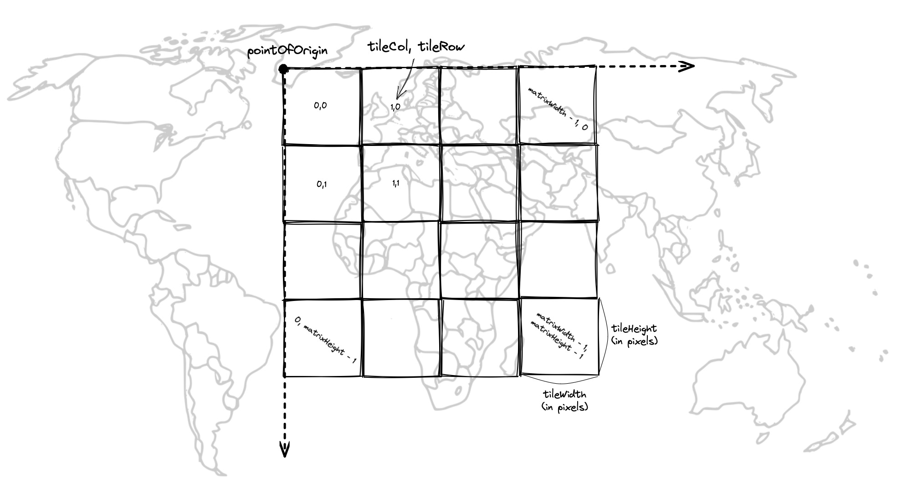

# morecantile-ts

> Derived from [Development Seed's deck.gl-raster](https://github.com/developmentseed/deck.gl-raster) monorepo (MIT), vendored into this repo — see [LICENSE](./LICENSE). Not this project's original work.

> Image credit [@vincentsarago].

[@vincentsarago]: https://github.com/vincentsarago

Typescript port of [Morecantile] for working with OGC [TileMatrixSet] grids.

[Morecantile]: https://github.com/developmentseed/morecantile
[TileMatrixSet]: https://docs.ogc.org/is/17-083r4/17-083r4.html
